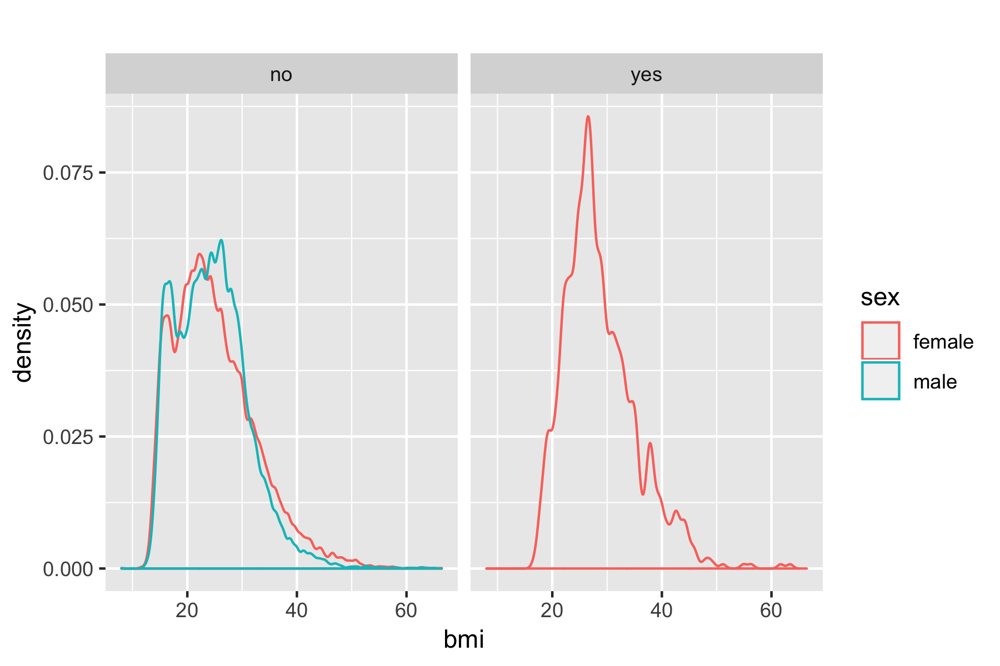
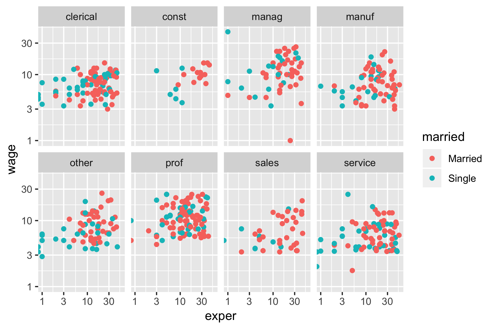

## Front Matter

Install supporting R packages with necessary functions and data sets.  You will need to add `library(DataComputing)` to the code chunk.  Note the line `rm(list = ls())` at the beginning of the code chunk, this will effectively reset your R environment which can help avoid bugs when an analysis gets more complicated. 

```{r} 
rm(list = ls()) ## cleans up your R environment

# load packages
library(mosaic)
library(mosaicData)  # includes `CPS85 data
library(tidyverse)   # loads a group of useful packages including `ggplot2`


# read data sets from R packages
data("NCHS") # from the `DataComputing` package
data("CPS85") # from the `mosaicData` package
data("diamonds") # from the `ggplot2` package
```


###  Problem 5.2 (from DC Exercises)

{width=600px}

Using the `NCHS` data table, produce the `ggplot2` code that reproduces the above graphic.  Note: The "yes" and "no" in the gray bars refer to whether or not the person is pregnant.  Show your R code and the plot it produces using the empty code chunk below.


```{r}

ggplot( data = NCHS, aes(x = bmi)) + geom_density(adjust = 0.4) + aes(colour = sex) + facet_wrap(~pregnant, ncol = 4) + labs(title = "") + theme(legend.position = "right") 
```


###  Problem 5.3 (from DC Exercises)

{width=600px}


Using the `CPS85` data table, produce the `ggplot2` code that reproduces the above graphic.  Show your R code and the plot it produces using the empty code chunk below.


```{r}

ggplot(data=CPS85,aes(x=exper,y=wage))+geom_point()+aes(colour=married)+scale_x_log10()+scale_y_log10()+facet_wrap(~sector,ncol=4) 
```


### Your Turn: explore the `diamonds` data

*Task: Produce an interesting graphic of the `diamonds` data set.  The graphic should represent AT LEAST 3 variables.  Write a few sentences to describe what you have learned.*

```{r}
# read `diamonds` data into R; it has been provided by the `ggplot2` package
data("diamonds")

# add your code below for your one key data visualization

ggplot(data=diamonds,aes(x=reorder(clarity,price),y=carat,order=reorder(cut,carat),fill=cut))+geom_bar(stat='identity',position='stack', width=.9)+scale_fill_brewer(type='qual',palette=1) 
```

From the above diamonds bar graph, I learn that most of diamond cut focus on "premium" and "ideal", fair cut diamonds are not too many, the amounts of "fair"" cut diamonds increased as price increased. The "ideal"" cut has highest carat value for each clarity.There are two types of "premium" cut, the higher carat is rare.

### Extension: programming style

The helper functions are great, but they produce ugly code.  Clean up the `ggplot2` code that reproduces the required plots so that it aligns with the R Programming Style Guide Appendix in the *DataComputing* eBook <https://dtkaplan.github.io/DataComputingEbook/>.  


